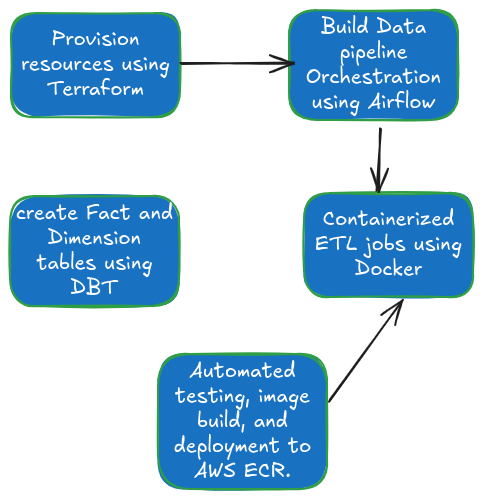

# Travel Agency Data Platform

## Project Overview

This project is a data platform for a travel agency, designed as part of the
Core Data Engineers Capstone Projects. The goal is to extract, transform, and
load (ETL) travel-related data from an API into a data warehouse for analysis.
The platform utilizes cloud infrastructure and tools to handle data ingestion,
processing, storage, and reporting, enabling the travel agency to make
data-driven decisions.

## Table of Contents

-   [Technologies Used](#technologies-used)
-   [Infrastructure Overview](#infrastructure-overview)
-   [Data Pipeline](#data-pipeline)
-   [Setup and Installation](#setup-and-installation)
-   [Usage](#usage)
-   [CI/CD Pipeline](#cicd-pipeline)
-   [Challenges and Solutions](#challenges-and-solutions)
-   [Slide presntation and image](#slide-presentation-and-other-images)

## Technologies Used

1.  Amazon Web Services (AWS):

    -   S3: For storing raw data in Parquet format.
    -   Amazon Redshift: Data warehouse used to store processed data for
        analysis.
    -   Amazon ECR: Docker image repository for containerized services.
    -   Apache Airflow: Manages and orchestrates the ETL workflow.

2.  DBT (Data Build Tool): Handles data transformation and modeling inside
    Redshift.

3.  Docker: Containerizes the application for consistent deployment
    environments.

4.  Terraform: Used for infrastructure provisioning, ensuring the environment is
    automatically and consistently set up.

5.  GitHub Actions: Facilitates Continuous Integration and Continuous Deployment
    (CI/CD), including code linting, testing, and deploying Docker images.

6.  Python Libraries:
    -   awswrangler: Interacts with AWS services for data loading and retrieval.
    -   requests: Used for making HTTP requests to the travel API for data
        extraction.
    -   flake8: Linting tool used to ensure code quality.

## Infrastructure Overview

The infrastructure for this project is fully deployed on AWS, and Terraform is
used to provision the following resources:

-   Amazon S3: Stores raw data as Parquet files.
-   Amazon Redshift: Houses the processed data after transformation by DBT.
-   Amazon ECR: Stores the Docker image of the application, which can be used
    across multiple environments.
-   IAM Roles and Policies: Ensure secure access to AWS resources.

The infrastructure follows best practices in terms of scalability, security, and
reliability.

## Data Pipeline

1. Data Extraction: The data is extracted from a travel-related API (provided in
   the capstone project). The API delivers data in JSON format, which is then
   processed further.

2. Data Transformation: - Apache Airflow orchestrates the ETL process, ensuring
   that tasks such as data extraction, transformation, and loading occur in a
   predefined sequence. - DBT is responsible for transforming the raw data into
   fact and dimension tables in Redshift. This step involves cleaning the data,
   performing joins, and creating a structured model for business reporting.
3. Data Storage:

    - Raw Data: Stored in Amazon S3 as Parquet files for long-term storage.
    - Processed Data: Loaded into Amazon Redshift for querying and analysis.

## Setup and Installation

### Prerequisites

-   AWS Account with access to S3, Redshift, and ECR.
-   Docker installed on your local machine.
-   Terraform installed to manage infrastructure provisioning.
-   Python 3.8+ for running local scripts and DBT transformations.

## Clone the Repository

` git clone https://github.com/femmyte/travel_agency_data_platform.git`\
 ` cd travel_agency_data_platform`

## Set Up AWS Credentials

Make sure your AWS credentials are properly configured either through the
~/.aws/credentials file or by exporting them as environment variables:

`export AWS_ACCESS_KEY_ID=your-access-key-id`\
`export AWS_SECRET_ACCESS_KEY=your-secret-access-key`

### Provision Infrastructure with Terraform

Navigate to the terraform directory and initialize Terraform:

`cd terraform` \
`terraform init`

To provision the infrastructure, run:

`terraform apply`

Confirm the action to provision the necessary AWS resources such as S3 buckets,
Redshift clusters, and ECR.

## Usage

-   Running the ETL Pipeline Start Apache Airflow using Docker Compose:

        - docker-compose up

    Access the Airflow UI at http://localhost:8080 and trigger the DAG
    responsible for the ETL process.

        - Running DBT Transformations Navigate to the dbt directory and install

    dependencies:

`cd dbt`\
`dbt deps` \

Run the DBT models to create fact and dimension tables in Redshift: \

`dbt run`\

## CI/CD Pipeline

The project includes a GitHub Actions workflow for continuous integration and
deployment. The workflow:

    - Runs flake8 to lint the code and ensure it adheres to Python style guidelines.
    - Builds and pushes the Docker image to Amazon ECR.
    - Deploys the Docker container using the updated image.

Ensure you set the following GitHub secrets in your repository for the CI/CD
pipeline:

-   `AWS_ACCESS_KEY_ID` \
-   ` AWS_SECRET_ACCESS_KEY ECR_URI` \

## Challenges and Solutions

1. Data Transformation Complexity Handling complex data transformations required
   using DBT to create an optimized dimensional model. DBT allowed the project
   to efficiently organize the data into fact and dimension tables in Redshift,
   which simplifies querying and reporting.

2. Dockerization Ensuring consistency across development, testing, and
   production environments was achieved using Docker. By containerizing the
   entire application, the project can be deployed quickly with the same
   environment configuration.

3. Infrastructure Provisioning Terraform was used to automate the provisioning
   of AWS resources, ensuring that the infrastructure is consistently replicated
   in any environment, reducing manual configuration errors.

## Slide Presentation and other images

[Click here to access Slide presentation](https://docs.google.com/presentation/d/1uNopenxyOTWtMGpPgVXJK9C4btCqFXm4AGOX7Ix9TSc/edit?usp=sharing)

### Project workflow

### airflow workflow

 

### DAG Output

